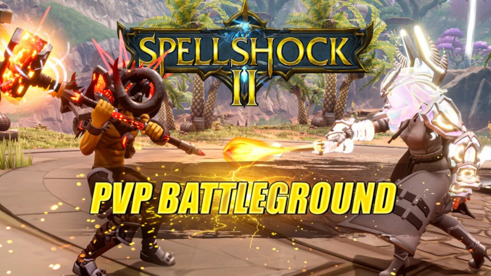

# Corehaven Chronicles

In this fantasy PvP battleground, the warring Legion of Light and Dark Devout clash to gain dominion over the war-torn land. Strategize with your teammates to capture and control power crystals on this classic battlefield. Choose from any of five unique MOBA inspired classes, each outfitted with specialized powers, appearances, and playstyles. Level up your skills, collect treasure after each round, and master your favorite class!

## Credits

- META Director: Buckmonster
- Design Leads: Buckmonster, Bigglebuns
- Inspiration, Design, Initial Map: Basilisk
- Producer: Rolok
- Technical Lead: Standardcombo
- Lead Developers: Ooccoo, Morticai
- Support Developers: Estlogic, Divided
- Map design and creation: Melamoryxq
- UI design and art: KonzZwodrei
- Lead Costume Artist: WitcherSilver
- Sound & Music: Deadlyfishes
- Test Lead: AJ
- Additional Art, UI: WitcherSilver, Melamoryxq
- Amazing Costumes: Aggripina, AwkwardGameDev, Melamoryxq, mjcortes782
- Amazing Ability Art: WitcherSilver, Ooccoo
- Special Thanks: Shhteve
- Special Thanks: Neil and Matthew Pablo!
- Special Thanks: Tobs for streaming awesomeness
- Special Thanks: Our Manticore family of playtesters!

## CC Components:
- Chicken Player -- WaveParadigm (art updated by WitcherSilver)
- EaseUI -- NicholasForeman
- META Cosmetic Store -- Montoli, Estlogic, Buckmonster
- Teleportation Network -- standardcombo
- Roaming Spectating Cam  -- standardcombo
- Simple Audio Trigger -- deadlyfishes

## Project Structure

Spellshock 2 consists of 7 games, each of those are in their respective top level folder of the project:

- DungeonHubWorld, the main game.
- Dungeon_01
- Dungeon_02

## Feedback & Support

Please use GitHub issues for feedback and support.

## Contributing

If you are interested in fixing issues and contributing directly to the code base, please see our [contributing guidelines](CONTRIBUTING.md).

## License

Licensed under the [Apache License 2.0](LICENSE) license.
